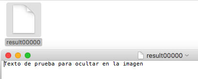

# Práctica 1 - Encriptación/desencriptación en Linux

## Sesión 7 - Crifrado de sistemas de archivos. Esteganografía y estegoanálisis.

### **Hugo Maldonado Cózar**
# <a></a>

### **Ejercicio 7.1**
#### Utilizar `cryptsetup` para crear una partición encriptada en un pedrive.

Una vez introducido el pen drive. Nos aseguremos que está conectado a la máquina virtual en la que lo estamos realizando:

```
# Nos logueamos como usuario root primero
$ sudo su
[sudo] password for hugomaldonado: 

# fdisk -l
...
Disk /dev/sdb: 971,6 MiB, 1018773504 bytes, 1989792 sectors
Units: sectors of 1 * 512 = 512 bytes
Sector size (logical/physical): 512 bytes / 512 bytes
I/O size (minimum/optimal): 512 bytes / 512 bytes
Disklabel type: gpt
Disk identifier: 7DEDEE50-642C-44BB-AF7B-88CB15BB1E7A

Disposit.  Start   Final Sectores  Size Tipo
/dev/sdb1   2048 1988607  1986560  970M Microsoft basic data
```

Luego ya sabemos que sí está montado y además es el dispositivo ubicado en `/dev/sdb` y la única partición que tiene es `/dev/sdb1`.

Una vez instalada la herramienta `cryptsetup`.

Lo primero desmontamos el pen drive:

```
# umount /dev/sdb1 
```

Y ahora procedemos a la encriptación del pen drive:

```
# cryptsetup -c aes -h sha256 -y -s 256 luksFormat /dev/sdb1

WARNING!
========
Sobrescribirá los datos en /dev/sdb1 de forma irrevocable.

Are you sure? (Type uppercase yes): YES
Introduzca frase contraseña: 
Verificar frase de paso: 
```

Nos pide una contraseña para el cifrado, y ya tenemos el dispositivo cifrado.

Ahora vamos a proceder a abrirlo para probar la encriptación.

Lo primero que tenemos que hacer es abrirlo con `cryptsetup`:

```
# cryptsetup luksOpen /dev/sdb1 prueba
Introduzca una contraseña para /dev/sdb1: 
```

Ya estaría abierto por la herramienta, después de introducir la contraseña.

Ahora vamos a mapear el dispositivo a un no real:

Primero vamos a darle formato con `mkfs`:

```
# mkfs /dev/mapper/prueba 
mke2fs 1.43.3 (04-Sep-2016)
Se está creando un sistema de ficheros con 247808 bloques de 4k y 61952 nodos-i
UUID del sistema de ficheros: 0579c3c0-1794-4986-a4f2-20acff9e7ace
Respaldo del superbloque guardado en los bloques: 
	32768, 98304, 163840, 229376

Reservando las tablas de grupo: hecho                            
Escribiendo las tablas de nodos-i: hecho                            
Escribiendo superbloques y la información contable del sistema de archivos: hecho
```

Y finalmente montamos el dispositivo mapeado:

```
# mount /dev/mapper/prueba /media/pen/

# ls /media/pen/
lost+found
```

Como se puede ver, ya está montado y con acceso a él. Vamos a probar a hacer una prueba escribiendo un fichero.

```
# echo "PRUEBA CIFRADO" > /media/pen/prueba.txt

# ls /media/pen/
lost+found  prueba.txt

# cat /media/pen/prueba.txt 
PRUEBA CIFRADO
```

Luego ya vemos como se está accediendo al dispositivo correctamente y se puede escribir y leer del mismo.

Ahora vamos a expulsarlo. Primero desmontamos el dispositivo mapeado:

```
# umount /dev/mapper/prueba
```

Y ahora cerramos el dispositivo con la herramienta `cryptsetup`:

```
# cryptsetup luksClose /dev/mapper/prueba
```

Para realizar la última comprobación, he quitado el pen drive de la máquina y voy a volver a conectarlo para asegurar el funcionamiento:

```
# fdisk -l
...
Disk /dev/sdb: 971,6 MiB, 1018773504 bytes, 1989792 sectors
Units: sectors of 1 * 512 = 512 bytes
Sector size (logical/physical): 512 bytes / 512 bytes
I/O size (minimum/optimal): 512 bytes / 512 bytes
Disklabel type: gpt
Disk identifier: 7DEDEE50-642C-44BB-AF7B-88CB15BB1E7A

Disposit.  Start   Final Sectores  Size Tipo
/dev/sdb1   2048 1988607  1986560  970M Microsoft basic data
```

Ahora vamos a realizar los pasos anteriores, aunque sin darle formato, porque ya lo tenemos con formato:

```
# cryptsetup luksOpen /dev/sdb1 prueba
Introduzca una contraseña para /dev/sdb1: 

# mount /dev/mapper/prueba /media/pen/

# cat /media/pen/prueba.txt 
PRUEBA CIFRADO
```

Y podemos ver cómo funciona y podemos acceder al contenido una vez que lo hemos abierto e introducido la contraseña que le asignamos cuando lo hicimos.

### **Ejercicio 7.2**
#### Utilizar la herramienta Steghide para ocultar un mensaje dentro de una imagen, tal como acabamos de ver. Comparar los archivos portador antes y después de usar la técnica para ver las diferencias.

Lo primero que tenemos que hacer es descargar el paquete `Steghide`:

```bash
$ sudo apt install steghide 
```

Ahora, vamos a descargarnos una imagen cualquiera de internet, para ocultar la información. Como estoy realizándolo en `Ubuntu Server` voy a hacerlo con la herramienta `wget`:

```bash
$ wget http://www.menaitech.com/wp-content/uploads/2016/04/image1.jpeg
--2016-11-28 18:41:11--  http://www.menaitech.com/wp-content/uploads/2016/04/image1.jpeg
Resolviendo www.menaitech.com (www.menaitech.com)... 108.61.154.179
Conectando con www.menaitech.com (www.menaitech.com)[108.61.154.179]:80... conectado.
Petición HTTP enviada, esperando respuesta... 200 OK
Longitud: 242687 (237K) [image/jpeg]
Grabando a: “image1.jpeg”

image1.jpeg            100%[==========================>] 237,00K   372KB/s    in 0,6s    

2016-11-28 18:41:12 (372 KB/s) - “image1.jpeg” guardado [242687/242687]

$ ls
image1.jpeg

# Realizamos una copia de la imagen original, antes de ocultar información
$ cp image1.jpeg image2.jpeg 

$ ls
image1.jpeg  image2.jpeg
```

Ahora vamos a crear el texto que vamos a ocultar en la imagen:

```bash
$ echo "Texto de prueba para ocultar en la imagen" > 

$ ls
image1.jpeg  image2.jpeg  test.txt

$ cat test.txt
Texto de prueba para ocultar en la imagen
```

Ya tenemos todo disponible para el proceso:

```
$ steghide embed -cf image1.jpeg -ef test.txt 
Anotar salvoconducto: 
Re-ingresar salvoconducto: 
adjuntando "test.txt" en "image1.jpeg"... hecho
```

Ahora ya tenemos la imagen con la información ocultada, si la abrieramos con un visor de fotografías, no  notaríamos ninguna diferencia.

Nos conectamos por `ftp` a la máquina y obtenemos la imagen con el mensaje oculto:

```bash
sftp> ls
image1.jpeg    image2.jpeg    test.txt       
sftp> get image1.jpeg
Fetching /home/hugomaldonado/image1.jpeg to image1.jpeg
/home/hugomaldonado/image1.jpeg                         100%  241KB 241.3KB/s   00:00   
```

Y en la máquina anfitrión podemos observar cómo no hay ninguna diferencia con la original:


(foto con la información oculta)


(foto sin la información oculta)

Por lo que podemos ver que el proceso ha sido un éxito.

Ahora vamos a comparar ambos imágenes para ver diferencias. Vamos a empezar comparando el tamaño del fichero:

```
$ du -sh image1.jpeg 
244K	image1.jpeg

$ du -sh image2.jpeg 
240K	image2.jpeg

$ du -sh test.txt 
4,0K	test.txt
```

Podemos ver como la imagen en la que hemos ocultado texto ocupa 4 KB más que la que no tiene texto oculto. El tamaño que ha crecido la imagen con el texto oculto, es justo el mismo que ocupa el fichero que hemos ocultado en dicha imagen, lo cual nos indica como verdaderamente se ha ocultado el mensaje.

Otra forma en que voy a comprobar si ambas fotos son iguales o no es creando un script `bash` que obtenga la `base64` de ambas imágenes y las compare.

El script es el siguiente:

```bash
#!/bin/bash

# Get base64 encoded image
IMG1="$(cat ./image1.jpeg | base64)"
IMG2="$(cat ./image2.jpeg | base64)"

#See if the images are the same
if [ "$IMG1" == "$IMG2" ]; then
    echo "The images are the same!"
else
    echo "The images are different"
fi
```

Ahora voy a ejecutarlo:

```
$ chmod +x compare.sh

$ ./compare.sh 
The images are different
```

Luego si la `base64` de ambas imágenes no coinciden es efectivamente porque no son iguales.

Voy a efectuar un método parecido obteniendo la firma `HASH` de ambas con `md5`:

```
$ md5sum image1.jpeg 
34f71dc60c33013b6fdfd4fa92e77c1f  image1.jpeg

$ md5sum image2.jpeg 
a17c5295d920d0bf0a5078356e81b745  image2.jpeg
```

Como se puede apreciar, las firmas digitales no coinciden, por lo que son, a ciencia cierta, distintas, o ha sido manipulada en este caso.

### **Ejercicio 7.3**
#### Utilizar VSL para analizar la imagen esteganográfica generada en el ejercicio anterior para detectar información oculta.

Dado que la herramienta `VSL` es gráfica, no podemos ejecutarla en `Ubuntu Server` sin tener entorno gráfico instalado, por lo que voy a realizarla en la máquina anfitrión ejecutando `macOS Sierra 10.12.1`.

Lo primero vamos a realizarle un análisis:


Obtenemos en la carpeta `results` un `.csv` con la información del análisis:


Como se puede apreciar, con este análisis, ha identificado que la imagen ha sido modificada y oculta un mensaje y nos indica el tamaño aproximado del mismo. 

Ahora, vamos a sacar el mensaje oculto utilizando el siguiente mecanismo de decodificación:


Y dándole a ejecutar obtenemos en la carpeta `results` el fichero con el texto anteriormente ocultado.

