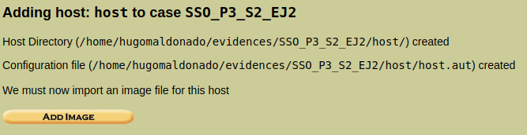

# Práctica 3 - Auditoría informática e Informática forense


## Sesión 1 - Análisis forense en Linux

### **Hugo Maldonado Cózar**
# <a></a>

### **Ejercicio 3.1.1**
#### Vamos a crear en nuestro pendrive un archivo con un supuesto texto de una amenaza y luego vamos a borrarlo. Aplicando las herramientas anteriores vamos a intentar recuperar lo que quede del archivo borrado haciendo una copia del pendrive sobre la que trabajar, no directamente sobre el pendrive.

Primero vamos a crear el supuesto fichero con la amenaza que vamos a copiar al pen drive: 

```bash
$ echo "Texto de prueba con la posible amenaza" > test

$ ls
test

$ cat test 
Texto de prueba con la posible amenaza
```

Ahora vamos a montar el pen drive en la máquina donde vamos a realizar el análisis:

```bash
$ sudo fdisk -l /dev/sd*
Disk /dev/sda: 64 GiB, 68719476736 bytes, 134217728 sectors
Units: sectors of 1 * 512 = 512 bytes
Sector size (logical/physical): 512 bytes / 4096 bytes
I/O size (minimum/optimal): 4096 bytes / 4096 bytes
Disklabel type: dos
Disk identifier: 0xa39e4151

Disposit.  Inicio     Start     Final  Sectores Size Id Tipo
/dev/sda1  *           2048 125829119 125827072  60G 83 Linux
/dev/sda2         125831166 134215679   8384514   4G  5 Extendida
/dev/sda5         125831168 134215679   8384512   4G 82 Linux swap / Solaris

Partition 2 does not start on physical sector boundary.


Disk /dev/sdb: 971,6 MiB, 1018773504 bytes, 1989792 sectors
Units: sectors of 1 * 512 = 512 bytes
Sector size (logical/physical): 512 bytes / 512 bytes
I/O size (minimum/optimal): 512 bytes / 512 bytes
Disklabel type: gpt
Disk identifier: ABAC49C4-BE8C-493C-BF44-7178B26CE17E

Disposit.  Start   Final Sectores  Size Tipo
/dev/sdb1   2048 1988607  1986560  970M Microsoft basic data

$ sudo mkdir /mnt/pen

$ sudo mount /dev/sdb1 /mnt/pen/
```

Y ahora copiamos el fichero al pen drive: 

```bash
$ sudo cp test /mnt/pen/

$ ls /mnt/pen/
test

$ cat /mnt/pen/test 
Texto de prueba con la posible amenaza
```

Ahora vamos a desmontar el pen drive, volverlo a montar y borrar el fichero que acabamos de introducir:

```
$ sudo umount /mnt/pen

$ ls /mnt/pen/

$ sudo fdisk -l /dev/sd*
Disk /dev/sda: 64 GiB, 68719476736 bytes, 134217728 sectors
Units: sectors of 1 * 512 = 512 bytes
Sector size (logical/physical): 512 bytes / 4096 bytes
I/O size (minimum/optimal): 4096 bytes / 4096 bytes
Disklabel type: dos
Disk identifier: 0xa39e4151

Disposit.  Inicio     Start     Final  Sectores Size Id Tipo
/dev/sda1  *           2048 125829119 125827072  60G 83 Linux
/dev/sda2         125831166 134215679   8384514   4G  5 Extendida
/dev/sda5         125831168 134215679   8384512   4G 82 Linux swap / Solaris

Partition 2 does not start on physical sector boundary.


Disk /dev/sdb: 971,6 MiB, 1018773504 bytes, 1989792 sectors
Units: sectors of 1 * 512 = 512 bytes
Sector size (logical/physical): 512 bytes / 512 bytes
I/O size (minimum/optimal): 512 bytes / 512 bytes
Disklabel type: gpt
Disk identifier: ABAC49C4-BE8C-493C-BF44-7178B26CE17E

Disposit.  Start   Final Sectores  Size Tipo
/dev/sdb1   2048 1988607  1986560  970M Microsoft basic data

$ sudo mount /dev/sdb1 /mnt/pen/

$ ls /mnt/pen/
test

$ cat /mnt/pen/test 
Texto de prueba con la posible amenaza

$ sudo rm /mnt/pen/test 

$ ls /mnt/pen/
```

Una vez tenemos el escenario preparado, vamos a realizar una copia exacta del pen drive sobre la que trabajar en vez de hacerlo directamente sobre el pen drive físico y asignarle permisos de sólo lectura para evitar modificaciones y datos no reales introducidos para el análisis:

```
$ sudo dd if=/dev/sdb1 of=/home/hugomaldonado/image.disk1 bs=512 
1986560+0 registros leídos
1986560+0 registros escritos
1017118720 bytes (1,0 GB, 970 MiB) copied, 60,9501 s, 16,7 MB/s

$ du image.disk1 
993284	image.disk1

$ ls
image.disk1  test

$ sudo chmod 444 image.disk1 
```

Ahora vamos a desmontar el pen drive y a trabajar directamente sobre la imagen:

```
$ sudo umount /mnt/pen

$ sudo mkdir /mnt/image-pen

$ sudo mount image.disk1 /mnt/image-pen/

$ ls /mnt/image-pen/

$ ls -lna /mnt/image-pen/
total 16
drwxr-xr-x 4 0 0 4096 ene  1  1970 .
drwxr-xr-x 4 0 0 4096 ene  8 11:15 ..
drwxr-xr-x 2 0 0 4096 ene  8  2017 .fseventsd
drwxr-xr-x 4 0 0 4096 ene  8  2017 .Spotlight-V100
```

Aunque con la orden `ls` no hemos encontrado ningún archivo, vamos a utilizar otras técnicas para ver si hay algún archivo en la imagen que acabamos de montar:

```
$ cd /mnt/image-pen/

$ find . -type f -print > /home/hugomaldonado/listFiles.txt

$ cat /home/hugomaldonado/listFiles.txt 
./.Spotlight-V100/Store-V2/89D964F4-0FB7-43E9-A9E9-4BD41B53F8F8/psid.db
./.Spotlight-V100/Store-V2/89D964F4-0FB7-43E9-A9E9-4BD41B53F8F8/tmp.SnowLeopard
./.Spotlight-V100/Store-V2/89D964F4-0FB7-43E9-A9E9-4BD41B53F8F8/tmp.Lion
./.Spotlight-V100/Store-V2/89D964F4-0FB7-43E9-A9E9-4BD41B53F8F8/Lion.created
./.Spotlight-V100/Store-V2/89D964F4-0FB7-43E9-A9E9-4BD41B53F8F8/tmp.Cab
./.Spotlight-V100/Store-V2/89D964F4-0FB7-43E9-A9E9-4BD41B53F8F8/Cab.created
./.Spotlight-V100/Store-V2/89D964F4-0FB7-43E9-A9E9-4BD41B53F8F8/indexState
./.Spotlight-V100/Store-V2/89D964F4-0FB7-43E9-A9E9-4BD41B53F8F8/0.indexHead
./.Spotlight-V100/Store-V2/89D964F4-0FB7-43E9-A9E9-4BD41B53F8F8/0.indexIds
./.Spotlight-V100/Store-V2/89D964F4-0FB7-43E9-A9E9-4BD41B53F8F8/0.indexGroups
./.Spotlight-V100/Store-V2/89D964F4-0FB7-43E9-A9E9-4BD41B53F8F8/0.indexPostings
./.Spotlight-V100/Store-V2/89D964F4-0FB7-43E9-A9E9-4BD41B53F8F8/0.indexTermIds
./.Spotlight-V100/Store-V2/89D964F4-0FB7-43E9-A9E9-4BD41B53F8F8/0.indexPositions
./.Spotlight-V100/Store-V2/89D964F4-0FB7-43E9-A9E9-4BD41B53F8F8/0.indexPositionTable
./.Spotlight-V100/Store-V2/89D964F4-0FB7-43E9-A9E9-4BD41B53F8F8/0.indexDirectory
./.Spotlight-V100/Store-V2/89D964F4-0FB7-43E9-A9E9-4BD41B53F8F8/0.indexCompactDirectory
./.Spotlight-V100/Store-V2/89D964F4-0FB7-43E9-A9E9-4BD41B53F8F8/0.indexArrays
./.Spotlight-V100/Store-V2/89D964F4-0FB7-43E9-A9E9-4BD41B53F8F8/0.indexUpdates
./.Spotlight-V100/Store-V2/89D964F4-0FB7-43E9-A9E9-4BD41B53F8F8/0.directoryStoreFile
./.Spotlight-V100/Store-V2/89D964F4-0FB7-43E9-A9E9-4BD41B53F8F8/live.0.indexHead
./.Spotlight-V100/Store-V2/89D964F4-0FB7-43E9-A9E9-4BD41B53F8F8/live.0.indexIds
./.Spotlight-V100/Store-V2/89D964F4-0FB7-43E9-A9E9-4BD41B53F8F8/live.0.indexGroups
./.Spotlight-V100/Store-V2/89D964F4-0FB7-43E9-A9E9-4BD41B53F8F8/live.0.indexPostings
./.Spotlight-V100/Store-V2/89D964F4-0FB7-43E9-A9E9-4BD41B53F8F8/live.0.indexTermIds
./.Spotlight-V100/Store-V2/89D964F4-0FB7-43E9-A9E9-4BD41B53F8F8/live.0.indexPositions
./.Spotlight-V100/Store-V2/89D964F4-0FB7-43E9-A9E9-4BD41B53F8F8/live.0.indexPositionTable
./.Spotlight-V100/Store-V2/89D964F4-0FB7-43E9-A9E9-4BD41B53F8F8/live.0.indexDirectory
./.Spotlight-V100/Store-V2/89D964F4-0FB7-43E9-A9E9-4BD41B53F8F8/live.0.indexCompactDirectory
./.Spotlight-V100/Store-V2/89D964F4-0FB7-43E9-A9E9-4BD41B53F8F8/live.0.indexArrays
./.Spotlight-V100/Store-V2/89D964F4-0FB7-43E9-A9E9-4BD41B53F8F8/live.0.indexUpdates
./.Spotlight-V100/Store-V2/89D964F4-0FB7-43E9-A9E9-4BD41B53F8F8/live.0.directoryStoreFile
./.Spotlight-V100/Store-V2/89D964F4-0FB7-43E9-A9E9-4BD41B53F8F8/store.db
./.Spotlight-V100/Store-V2/89D964F4-0FB7-43E9-A9E9-4BD41B53F8F8/.store.db
./.Spotlight-V100/Store-V2/89D964F4-0FB7-43E9-A9E9-4BD41B53F8F8/reverseDirectoryStore
./.Spotlight-V100/Store-V2/89D964F4-0FB7-43E9-A9E9-4BD41B53F8F8/tmp.spotlight.state
./.Spotlight-V100/Store-V2/89D964F4-0FB7-43E9-A9E9-4BD41B53F8F8/store_generation
./.Spotlight-V100/Store-V2/89D964F4-0FB7-43E9-A9E9-4BD41B53F8F8/journalExclusion
./.Spotlight-V100/Store-V2/89D964F4-0FB7-43E9-A9E9-4BD41B53F8F8/journals.scan/journal.1
./.Spotlight-V100/Store-V2/89D964F4-0FB7-43E9-A9E9-4BD41B53F8F8/shutdown_time
./.Spotlight-V100/Store-V2/89D964F4-0FB7-43E9-A9E9-4BD41B53F8F8/reverseDirectoryStore.shadow
./.Spotlight-V100/Store-V2/89D964F4-0FB7-43E9-A9E9-4BD41B53F8F8/0.shadowIndexHead
./.Spotlight-V100/Store-V2/89D964F4-0FB7-43E9-A9E9-4BD41B53F8F8/0.shadowIndexTermIds
./.Spotlight-V100/Store-V2/89D964F4-0FB7-43E9-A9E9-4BD41B53F8F8/0.shadowIndexPositionTable
./.Spotlight-V100/Store-V2/89D964F4-0FB7-43E9-A9E9-4BD41B53F8F8/0.shadowIndexArrays
./.Spotlight-V100/Store-V2/89D964F4-0FB7-43E9-A9E9-4BD41B53F8F8/0.shadowIndexCompactDirectory
./.Spotlight-V100/Store-V2/89D964F4-0FB7-43E9-A9E9-4BD41B53F8F8/0.shadowIndexDirectory
./.Spotlight-V100/Store-V2/89D964F4-0FB7-43E9-A9E9-4BD41B53F8F8/0.directoryStoreFile.shadow
./.Spotlight-V100/Store-V2/89D964F4-0FB7-43E9-A9E9-4BD41B53F8F8/0.shadowIndexGroups
./.Spotlight-V100/Store-V2/89D964F4-0FB7-43E9-A9E9-4BD41B53F8F8/live.0.shadowIndexHead
./.Spotlight-V100/Store-V2/89D964F4-0FB7-43E9-A9E9-4BD41B53F8F8/live.0.shadowIndexTermIds
./.Spotlight-V100/Store-V2/89D964F4-0FB7-43E9-A9E9-4BD41B53F8F8/live.0.shadowIndexPositionTable
./.Spotlight-V100/Store-V2/89D964F4-0FB7-43E9-A9E9-4BD41B53F8F8/live.0.shadowIndexArrays
./.Spotlight-V100/Store-V2/89D964F4-0FB7-43E9-A9E9-4BD41B53F8F8/live.0.shadowIndexCompactDirectory
./.Spotlight-V100/Store-V2/89D964F4-0FB7-43E9-A9E9-4BD41B53F8F8/live.0.shadowIndexDirectory
./.Spotlight-V100/Store-V2/89D964F4-0FB7-43E9-A9E9-4BD41B53F8F8/live.0.directoryStoreFile.shadow
./.Spotlight-V100/Store-V2/89D964F4-0FB7-43E9-A9E9-4BD41B53F8F8/live.0.shadowIndexGroups
./.Spotlight-V100/Store-V2/89D964F4-0FB7-43E9-A9E9-4BD41B53F8F8/store.updates
./.Spotlight-V100/Store-V2/89D964F4-0FB7-43E9-A9E9-4BD41B53F8F8/reverseStore.updates
./.Spotlight-V100/Store-V2/89D964F4-0FB7-43E9-A9E9-4BD41B53F8F8/permStore
./.Spotlight-V100/Store-V1/VolumeConfig.plist
./.Spotlight-V100/VolumeConfiguration.plist
./.fseventsd/fseventsd-uuid
./.fseventsd/00000000018c2e6d
./.fseventsd/00000000018c2e6e
```

Por ahora no se puede ver más que el pen drive fue formateado con un ordenador Mac. Vamos a probar otra forma para sacarlos todos por tipos de datos

```
$ find . -type f -exec file {} \; > /home/hugomaldonado/listFilesByType.txt

$ cat /home/hugomaldonado/listFilesByType.txt 
./.Spotlight-V100/Store-V2/89D964F4-0FB7-43E9-A9E9-4BD41B53F8F8/psid.db: SQLite 3.x database, last written using SQLite version 0
./.Spotlight-V100/Store-V2/89D964F4-0FB7-43E9-A9E9-4BD41B53F8F8/tmp.SnowLeopard: empty
./.Spotlight-V100/Store-V2/89D964F4-0FB7-43E9-A9E9-4BD41B53F8F8/tmp.Lion: empty
./.Spotlight-V100/Store-V2/89D964F4-0FB7-43E9-A9E9-4BD41B53F8F8/Lion.created: empty
./.Spotlight-V100/Store-V2/89D964F4-0FB7-43E9-A9E9-4BD41B53F8F8/tmp.Cab: empty
./.Spotlight-V100/Store-V2/89D964F4-0FB7-43E9-A9E9-4BD41B53F8F8/Cab.created: empty
./.Spotlight-V100/Store-V2/89D964F4-0FB7-43E9-A9E9-4BD41B53F8F8/indexState: data
./.Spotlight-V100/Store-V2/89D964F4-0FB7-43E9-A9E9-4BD41B53F8F8/0.indexHead: data
./.Spotlight-V100/Store-V2/89D964F4-0FB7-43E9-A9E9-4BD41B53F8F8/0.indexIds: data
./.Spotlight-V100/Store-V2/89D964F4-0FB7-43E9-A9E9-4BD41B53F8F8/0.indexGroups: data
./.Spotlight-V100/Store-V2/89D964F4-0FB7-43E9-A9E9-4BD41B53F8F8/0.indexPostings: data
./.Spotlight-V100/Store-V2/89D964F4-0FB7-43E9-A9E9-4BD41B53F8F8/0.indexTermIds: data
./.Spotlight-V100/Store-V2/89D964F4-0FB7-43E9-A9E9-4BD41B53F8F8/0.indexPositions: data
./.Spotlight-V100/Store-V2/89D964F4-0FB7-43E9-A9E9-4BD41B53F8F8/0.indexPositionTable: data
./.Spotlight-V100/Store-V2/89D964F4-0FB7-43E9-A9E9-4BD41B53F8F8/0.indexDirectory: data
./.Spotlight-V100/Store-V2/89D964F4-0FB7-43E9-A9E9-4BD41B53F8F8/0.indexCompactDirectory: data
./.Spotlight-V100/Store-V2/89D964F4-0FB7-43E9-A9E9-4BD41B53F8F8/0.indexArrays: data
./.Spotlight-V100/Store-V2/89D964F4-0FB7-43E9-A9E9-4BD41B53F8F8/0.indexUpdates: empty
./.Spotlight-V100/Store-V2/89D964F4-0FB7-43E9-A9E9-4BD41B53F8F8/0.directoryStoreFile: data
./.Spotlight-V100/Store-V2/89D964F4-0FB7-43E9-A9E9-4BD41B53F8F8/live.0.indexHead: data
./.Spotlight-V100/Store-V2/89D964F4-0FB7-43E9-A9E9-4BD41B53F8F8/live.0.indexIds: data
./.Spotlight-V100/Store-V2/89D964F4-0FB7-43E9-A9E9-4BD41B53F8F8/live.0.indexGroups: data
./.Spotlight-V100/Store-V2/89D964F4-0FB7-43E9-A9E9-4BD41B53F8F8/live.0.indexPostings: data
./.Spotlight-V100/Store-V2/89D964F4-0FB7-43E9-A9E9-4BD41B53F8F8/live.0.indexTermIds: data
./.Spotlight-V100/Store-V2/89D964F4-0FB7-43E9-A9E9-4BD41B53F8F8/live.0.indexPositions: data
./.Spotlight-V100/Store-V2/89D964F4-0FB7-43E9-A9E9-4BD41B53F8F8/live.0.indexPositionTable: data
./.Spotlight-V100/Store-V2/89D964F4-0FB7-43E9-A9E9-4BD41B53F8F8/live.0.indexDirectory: data
./.Spotlight-V100/Store-V2/89D964F4-0FB7-43E9-A9E9-4BD41B53F8F8/live.0.indexCompactDirectory: data
./.Spotlight-V100/Store-V2/89D964F4-0FB7-43E9-A9E9-4BD41B53F8F8/live.0.indexArrays: data
./.Spotlight-V100/Store-V2/89D964F4-0FB7-43E9-A9E9-4BD41B53F8F8/live.0.indexUpdates: empty
./.Spotlight-V100/Store-V2/89D964F4-0FB7-43E9-A9E9-4BD41B53F8F8/live.0.directoryStoreFile: data
./.Spotlight-V100/Store-V2/89D964F4-0FB7-43E9-A9E9-4BD41B53F8F8/store.db: data
./.Spotlight-V100/Store-V2/89D964F4-0FB7-43E9-A9E9-4BD41B53F8F8/.store.db: data
./.Spotlight-V100/Store-V2/89D964F4-0FB7-43E9-A9E9-4BD41B53F8F8/reverseDirectoryStore: data
./.Spotlight-V100/Store-V2/89D964F4-0FB7-43E9-A9E9-4BD41B53F8F8/tmp.spotlight.state: shared library
./.Spotlight-V100/Store-V2/89D964F4-0FB7-43E9-A9E9-4BD41B53F8F8/store_generation: data
./.Spotlight-V100/Store-V2/89D964F4-0FB7-43E9-A9E9-4BD41B53F8F8/journalExclusion: empty
./.Spotlight-V100/Store-V2/89D964F4-0FB7-43E9-A9E9-4BD41B53F8F8/journals.scan/journal.1: data
./.Spotlight-V100/Store-V2/89D964F4-0FB7-43E9-A9E9-4BD41B53F8F8/shutdown_time: ISO-8859 text
./.Spotlight-V100/Store-V2/89D964F4-0FB7-43E9-A9E9-4BD41B53F8F8/reverseDirectoryStore.shadow: data
./.Spotlight-V100/Store-V2/89D964F4-0FB7-43E9-A9E9-4BD41B53F8F8/0.shadowIndexHead: data
./.Spotlight-V100/Store-V2/89D964F4-0FB7-43E9-A9E9-4BD41B53F8F8/0.shadowIndexTermIds: empty
./.Spotlight-V100/Store-V2/89D964F4-0FB7-43E9-A9E9-4BD41B53F8F8/0.shadowIndexPositionTable: empty
./.Spotlight-V100/Store-V2/89D964F4-0FB7-43E9-A9E9-4BD41B53F8F8/0.shadowIndexArrays: data
./.Spotlight-V100/Store-V2/89D964F4-0FB7-43E9-A9E9-4BD41B53F8F8/0.shadowIndexCompactDirectory: data
./.Spotlight-V100/Store-V2/89D964F4-0FB7-43E9-A9E9-4BD41B53F8F8/0.shadowIndexDirectory: data
./.Spotlight-V100/Store-V2/89D964F4-0FB7-43E9-A9E9-4BD41B53F8F8/0.directoryStoreFile.shadow: data
./.Spotlight-V100/Store-V2/89D964F4-0FB7-43E9-A9E9-4BD41B53F8F8/0.shadowIndexGroups: very short file (no magic)
./.Spotlight-V100/Store-V2/89D964F4-0FB7-43E9-A9E9-4BD41B53F8F8/live.0.shadowIndexHead: data
./.Spotlight-V100/Store-V2/89D964F4-0FB7-43E9-A9E9-4BD41B53F8F8/live.0.shadowIndexTermIds: empty
./.Spotlight-V100/Store-V2/89D964F4-0FB7-43E9-A9E9-4BD41B53F8F8/live.0.shadowIndexPositionTable: empty
./.Spotlight-V100/Store-V2/89D964F4-0FB7-43E9-A9E9-4BD41B53F8F8/live.0.shadowIndexArrays: data
./.Spotlight-V100/Store-V2/89D964F4-0FB7-43E9-A9E9-4BD41B53F8F8/live.0.shadowIndexCompactDirectory: data
./.Spotlight-V100/Store-V2/89D964F4-0FB7-43E9-A9E9-4BD41B53F8F8/live.0.shadowIndexDirectory: data
./.Spotlight-V100/Store-V2/89D964F4-0FB7-43E9-A9E9-4BD41B53F8F8/live.0.directoryStoreFile.shadow: data
./.Spotlight-V100/Store-V2/89D964F4-0FB7-43E9-A9E9-4BD41B53F8F8/live.0.shadowIndexGroups: very short file (no magic)
./.Spotlight-V100/Store-V2/89D964F4-0FB7-43E9-A9E9-4BD41B53F8F8/store.updates: data
./.Spotlight-V100/Store-V2/89D964F4-0FB7-43E9-A9E9-4BD41B53F8F8/reverseStore.updates: data
./.Spotlight-V100/Store-V2/89D964F4-0FB7-43E9-A9E9-4BD41B53F8F8/permStore: data
./.Spotlight-V100/Store-V1/VolumeConfig.plist: XML 1.0 document, ASCII text
./.Spotlight-V100/VolumeConfiguration.plist: XML 1.0 document, ASCII text
./.fseventsd/fseventsd-uuid: ASCII text, with no line terminators
./.fseventsd/00000000018c2e6d: gzip compressed data, from Unix
./.fseventsd/00000000018c2e6e: gzip compressed data, from Unix
```

Como imaginamos, los datos que mayor interés nos pueden producir son los que de tipo texto, donde se ha almacenado información:

```
$ grep text /home/hugomaldonado/listFilesByType.txt 
./.Spotlight-V100/Store-V2/89D964F4-0FB7-43E9-A9E9-4BD41B53F8F8/shutdown_time: ISO-8859 text
./.Spotlight-V100/Store-V1/VolumeConfig.plist: XML 1.0 document, ASCII text
./.Spotlight-V100/VolumeConfiguration.plist: XML 1.0 document, ASCII text
./.fseventsd/fseventsd-uuid: ASCII text, with no line terminators
```

Pero tampoco muestra mayor información.


Vamos a crear una lista con las palabras sospechosas y ver si la imagen del pen aún contiene esta información aunque el fichero haya sido borrado:

```
$ nano LookList.txt
amenaza
posible
prueba
```

(He puesto estas palabras que pueden que no sean las que más sospechosas sean porque sé que eran algunas de las que contenía el fichero borrado y es para probar si encuentra la evidencias)

Ahora vamos a proceder a la búsqueda en sí:

```
$ grep -aibf LookList.txt image.disk1 > success.txt

$ ls
image.disk1  LookList.txt  success.txt  test

$ cat success.txt 
2823170:rXTexto de prueba con la posible amenaza
```

Como se puede ver, aun habiendo borrado el fichero, hemos encontrado el texto original que contiene todas las palabras de las que se ha hecho la búsqueda.

# <a></a>
### **Ejercicio 3.1.2**
#### Repetir el ejercicio anterior, 3.1.1, pero ahora utilizando la herramienta Autopsy.

Una vez instalado el TSK y Autopsy (configurado como carpeta de evidencias `/hombe/hugomaldonado/evidences`), podemos proceder a través del navegador con la url: `localhost:9999/autopsy`.


Ahora volvemos a copiar la imagen que habíamos creado en el ejercicio anterior:

```
$ sudo mount image.disk1 /mnt/image-pen/

$ ls /mnt/image-pen/
```

Y como podemos observar, está igual que en el ejercicio anterior.

Ahora le damos a Nuevo Caso y rellenamos la información correspondiente:


Ahora volvemos a la página inicial y hacemos click en abrir caso, seleccionamos el caso que acabamos de crear y le damos a abrir.

Una vez dentro, le damos a añadir Host y rellenamos la información que nos pide:




Ahora abrimos el caso que acabamos de crear:


Ahora le damos a añadir una imagen (del disco a inspeccionar)


Una vez creada, hacemos click en Analizar y posteriormente seleccionamos el método de Búsqueda de Palabras del menú superior


He probado con todas las cadenas que sí funcionaron en el ejercicio anterior, pero en autopsy no ha encontrado nada, volviendo a montar el disco, en diferentes tipos de partición (que te pide al añadir el disco) y en ningún caso he conseguido que lo encuentre:


Según podemos ver en su [documentación](http://www.sleuthkit.org/autopsy/help/grep_lim.html), la búsqueda por palabras está limitada y no bien depurada, por lo que no me es de extrañar que no funcione correctamente y no encuentre el archivo borrado anteriormente.